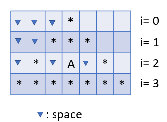

# Tutorial 2 - Task 2: Flow Control & Functions

## Task 2.1: Retruning Functions
In this task you'll practice working with loops and conditional structures to convert decimal numbers to other number formates. You'll also practice working with creating inner functions that can be sent as retrun values.

More specific instructions are included as comments in the file 'returningFunctions.js'.

If you would like to run the tests locally to check your work before submission you need to following the following steps
- Open a terminal inside the working directory
- Run the command `npm install` (only needed once)
- Run the command `npm test` (everytime you would like to run the tests)

## Task 2.2: callback Functions
In this task you'll create an over-simplified theme-based formater to practice working with callback functions, loops and conditional structures.

More specific instructions are included as comments in the file 'callbackFunctions.js'

### Some hints regarding drawing the triangle

For each line
- \# of spaces = 3 – i
- \# of stars  = 2*i + 1
- No need to fill the spaces on the right side since the rest of the line is empty anyways
- You’ll need to skip the third line to include the letter to be framed
